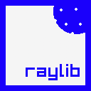

# Raylib-Lua Bindings

This project provides bindings for **Raylib** (a simple and easy-to-use game development library) to be used with **Lua**, a powerful, efficient, lightweight scripting language. With this binding, you can use Raylib's functionalities directly from Lua scripts, enabling rapid development of games and graphical applications.

## Features

- **Complete raylib 6.0 API coverage** — every public `RLAPI` function in `raylib.h` is bound (606 callables exposed via `require("raylib")`)
- **Simple, idiomatic Lua bindings** spanning **drawing**, **audio**, **textures**, **models**, **shaders**, **3D/2D cameras** & coordinate transforms, render-to-texture / blend / scissor modes, **gamepad/gesture/touch input**, **filesystem & data utilities**, VR, and automation events
- Colors as `{r,g,b,a}` tables or named constants (`RED`, `RAYWHITE`, …); `ClearBackground` and `DrawRectangle` additionally accept a packed `0xRRGGBBAA` integer
- Autocomplete available for VSCode: https://marketplace.visualstudio.com/items?itemName=LegendaryRedfox.raylib-lua-bindings-autocomplete
- Easily extendable: Add more bindings as you go!

## Prerequisites

Before building this project, ensure you have the following software installed:

### On Linux:

1. **GCC**: C compiler used for compiling the bindings.
2. **Make**: A tool to automate the build process.
3. **libX11** development headers (usually `libx11-dev`).

Raylib 6.0 and Lua 5.5.0 are **vendored** as static libraries — no system installation required. `make` builds `raylib.so` and the full `make test` suite passes on Linux.

### On Windows:

1. **GCC (MinGW)**: C compiler used for compiling the bindings.
2. **Make**: A tool to automate the build process.

> **Note**: Windows users must supply a Lua 5.5.0 `lua.lib` (the vendored one is for Lua 5.4) and a Raylib 6.0 import library.

### Additional Libraries (for both platforms):

- **Raylib** development files
- **Lua** development files

## Installation

### 1. Clone the repository

```bash
git clone https://github.com/yourusername/raylib-lua-bindings.git
cd raylib-lua-bindings
```

### 2. Install dependencies

#### On Linux:

Install a C toolchain and the X11 development headers:

```bash
sudo apt install build-essential libx11-dev   # Debian/Ubuntu
```

Raylib and Lua are vendored, so nothing else is needed — `make` links them from the bundled static libraries.

#### On Windows:

Download and install MinGW (GCC for Windows).
Download Raylib and Lua (make sure to install the development headers).

### 3. Build the project

Run the following command to compile and create the shared library:

```bash
make
```

This will generate the appropriate shared library file:

**Linux: raylib.so**
**Windows: raylib.dll**

### 4. Using the bindings

In your Lua script, you can require the Raylib bindings as follows:

```lua
local raylib = require("raylib")

-- Initialize the window
raylib.InitWindow(800, 600, "Raylib Lua Example")

-- Main game loop
while not raylib.WindowShouldClose() do
    raylib.BeginDrawing()
    raylib.ClearBackground(DARKGRAY)                          -- named color constant
    raylib.DrawText("Hello, Raylib and Lua!", 10, 10, 20, DARKGREEN)
    raylib.EndDrawing()
end

-- Close window
raylib.CloseWindow()
```

Colors are passed as a named constant or a `{r,g,b,a}` table. A packed 32-bit
integer (`0xRRGGBBAA`) is *additionally* accepted by `ClearBackground` and
`DrawRectangle`; every other function expects a table or named constant:

```lua
raylib.ClearBackground(RAYWHITE)                      -- named constant (a table)
raylib.ClearBackground({r=245, g=245, b=245, a=255})  -- explicit table
raylib.ClearBackground(0xF5F5F5FF)                    -- packed int (ClearBackground/DrawRectangle only)
raylib.DrawText("hi", 10, 10, 20, RAYWHITE)           -- other calls need a table/constant
```

### 5. Running tests

The suite (248 checks) covers text utilities and parsing, hashing (CRC32/MD5/SHA1/SHA256), color utilities, CPU-side image operations (generate/inspect/copy/transform), filesystem & path helpers, data (de)compression and base64, and random sequences — everything that runs without an open window.

```bash
make test
```

Tests are plain Lua scripts in `tests/` run against the bundled `raylib.so`. The only requirement is a Lua 5.5 interpreter on `PATH`.

### 6. Cleaning up

To remove the object files and shared library:

```bash
make clean
```

This will delete the compiled object files and the generated shared library (libraylib.so or raylib.dll).

| Make target | Effect |
|-------------|--------|
| `make` | Compile all sources, link `raylib.so` / `raylib.dll` |
| `make test` | Run the Lua unit test suite |
| `make clean` | Remove object files and the shared library |

### Known Issues

- Builds and passes the full test suite on both Linux and Windows. GPU/audio-dependent bindings (rendering, hardware textures, audio playback, input) still require a window or audio device and are verified by running example scripts rather than the headless test suite.
- `GetTargetFPS` is exposed for API symmetry but raylib has no such function; it delegates to `GetFPS()`.
- Audio stream processor callbacks dispatch to fixed Lua global function names, so only one processor of each type can be active at a time. **These callbacks run on raylib's internal audio thread and are not synchronized with the main Lua VM** — keep any handler minimal (a fully thread-safe design would marshal buffers to the main thread). A missing/failing handler is now handled gracefully instead of crashing.
- Raylib objects (textures, images, sounds, fonts, models, …) are returned as userdata and must be released with the matching `Unload*`; they are **not** garbage-collected automatically. Automatic `__gc` is intentionally omitted because raylib objects share ownership (a mesh inside a model, a texture inside a material), which would make blind finalization double-free. After `Unload*`, the userdata is zeroed so accidental reuse is a safe no-op rather than a use-after-free.
- Contributions to help resolve these issues are highly welcome.

### Contributing

If you would like to contribute, please feel free to fork the repository, submit issues, and create pull requests.

- Fork the repository
- Create a feature branch
- Commit your changes
- Push to the branch
- Open a pull request

## ☕ Support

If you find this project useful, consider supporting its development:

[](https://buymeacoffee.com/legendaryredfox)
